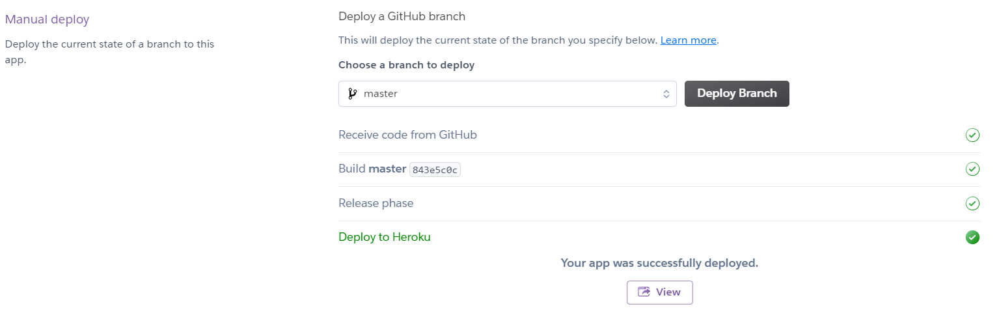
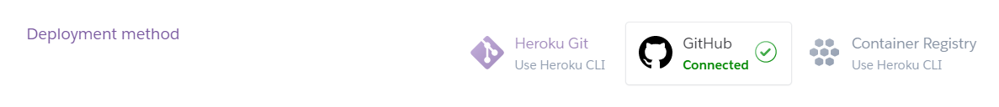
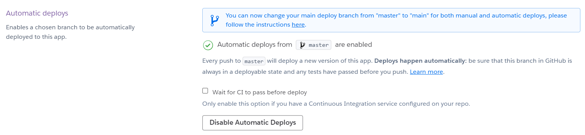

# LineTalk -  TOC Project 2021

> A Line bot based on a finite state machine for TOC Project 2021  
> Github repository: https://github.com/Eddielin0926/FSM-Line-Bot

## Usage

- Enter `@bot` for calling the menu  


- Select `設定個人資訊` to set your personal profile


- Select `配對設定` to set your personal preference


- Select `開始配對` to start talking to others


- While chatting, enter `@bot` to call the menu


- Select `我要猜拳🖐` to start a rock paper scissors


- Select `幫我想話題💬` to list some random topic


- Select `我要離開🏃` to leave the chat


## Setup

### Prerequisite

* Conda (Anaconda/Miniconda)

#### Install Dependency

- Create Conda environment
```sh
$ conda create --name toc python=3.6
$ conda activate toc
```

- Install pygraphviz
```sh
(toc) $ conda install -c conda-forge pygraphviz
```

- Install other dependencies
```sh
(toc) pip install python-dotenv pygraphviz transitions line-bot-sdk flask colorama
```

#### Secret Data

- Creat `.env` file and fill in your channel info
```dotenv
LINE_CHANNEL_SECRET=<your_line_channel_secret>
LINE_CHANNEL_ACCESS_TOKEN=<your_line_channel_access_token>
PORT=8000
```

#### Ngrok

- Download [Ngrok](https://ngrok.com/download) and execute

```sh
ngrok http 8000
```

#### Line Webhook

- Update webhook url
Concate the url generate by Ngrok  with /webhook (/callback) and put it to line bot channel


## Run Locally

- Start Conda environment
```sh
$ conda activate toc
```

- Execute program
```sh
(toc) $ python app.py
```

## Finite State Machine


## Deploy

Deploy the Line-bot server on Heroku.

### Heroku

* [macOS, Windows](https://devcenter.heroku.com/articles/heroku-cli)

### Connect to Heroku

- Register Heroku: https://signup.heroku.com  

- Create Heroku project from website  

- CLI Login  
```sh
$ heroku login
```


### Setup Environment on Heroku

- Setup environment variables  
```sh
heroku config:set LINE_CHANNEL_SECRET=<your_line_channel_secret>
heroku config:set LINE_CHANNEL_ACCESS_TOKEN=<your_line_channel_access_token>
```

- Fix `pygraphviz` intall error  
```
heroku buildpacks:set heroku/python
heroku buildpacks:add --index 1 heroku-community/apt
```

###### reference: https://hackmd.io/@ccw/B1Xw7E8kN?type=view#Q2-如何在-Heroku-使用-pygraphviz
### Connect Github Repository to Heroku

- Connect to your Github repository  


- If you have pushed to Github, you can use manual deploy  


- You can also use automatic deploy. Once you push your repository, Heroku will start deploy.  


### Complete

- url: `{HEROKU_APP_NAME}.herokuapp.com/callback`  
- logs: `heroku logs --tail --app {HEROKU_APP_NAME}`

## Reference

- [TOC-Project-2020](https://github.com/NCKU-CCS/TOC-Project-2020)
- [Pipenv](https://medium.com/@chihsuan/pipenv-更簡單-更快速的-python-套件管理工具-135a47e504f4) ❤️ [@chihsuan](https://github.com/chihsuan)
- [TOC-Project-2019](https://github.com/winonecheng/TOC-Project-2019) ❤️ [@winonecheng](https://github.com/winonecheng)
- Flask Architecture ❤️ [@Sirius207](https://github.com/Sirius207)
- [Line line-bot-sdk-python](https://github.com/line/line-bot-sdk-python/tree/master/examples/flask-echo)
- More details in the [Slides](https://hackmd.io/@TTW/ToC-2019-Project#) and [FAQ](https://hackmd.io/s/B1Xw7E8kN)